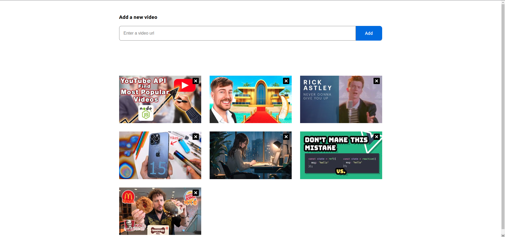
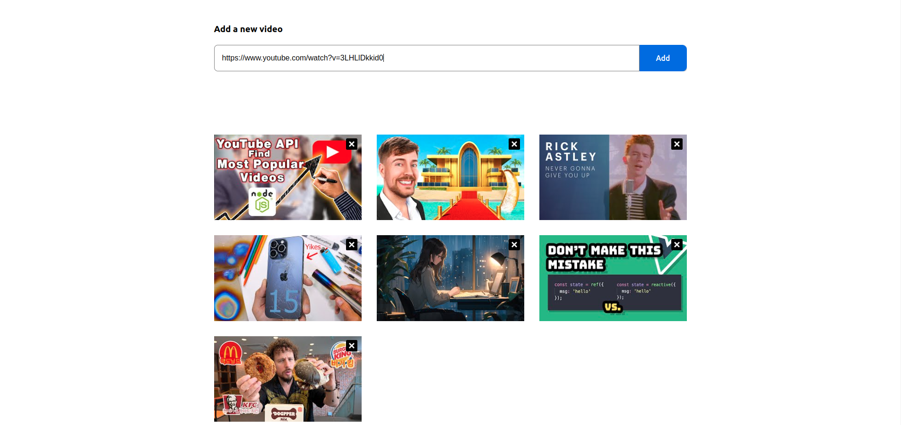
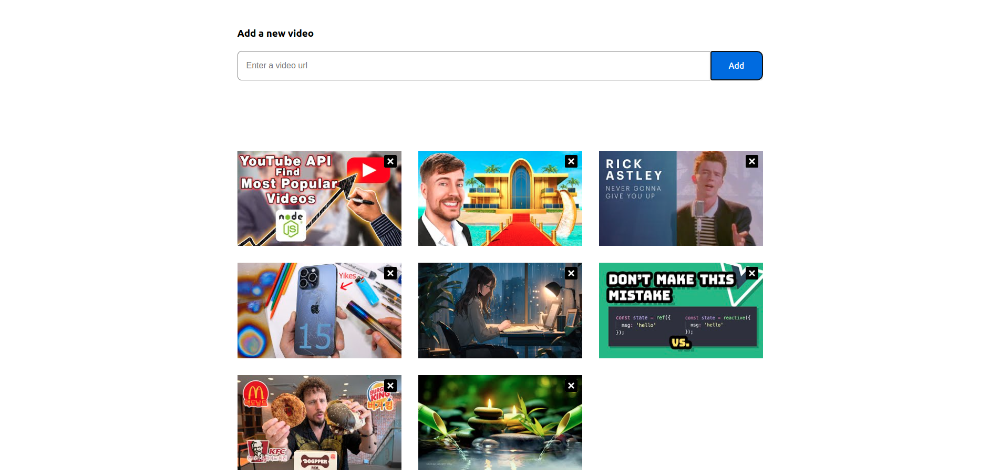
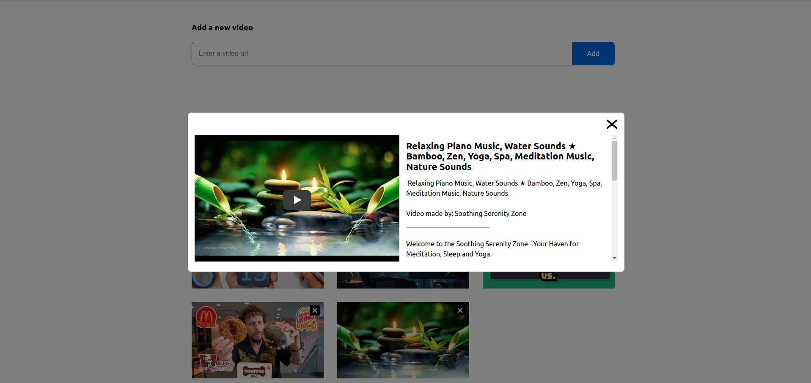
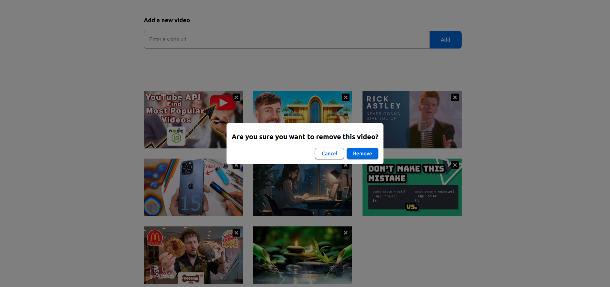

# AFEX challenge

This is a project as a part of AFEX's challenge. It consist in having a list of YouTube videos saved in its API and edit that list adding or remove a video.
It uses VueJS 3 and TypeScript in Vite.


## Steps

### Install NodeJS and npm

- Having NodeJS v16.x and above installed in your computer. You can get NodeJS [in this link](https://nodejs.org/en/download)
- Having npm v8.x and above installed in your computer.
- Having a terminal (either PowerShell or console prompt if you use Windows).
- Having the API so the app can consume its resources: https://github.com/et3858/afex-api-project.

You can get the installation guide on Windows and Mac [in this link](https://radixweb.com/blog/installing-npm-and-nodejs-on-windows-and-mac)


### Download the project

In this repository, go to "Code" button, then click on "Download ZIP" link in "Local" tab. Once it's downloaded, unzip the file into your preferred location and go to the project folder through the terminal.

Example:
```sh
cd path/to/the/project/afex-challenge-project
```

### Install modules and dependencies

```sh
npm install
```

### Copy and rename the .env.example file to .env and set the API url

```
VITE_API_URL="YOUR_API_URL"
```

### Run in development mode

```sh
npm run dev
```

By default, the project will be running at http://localhost:5173

### Compile and run in production mode

```sh
npm run build && npm run preview
```

By default, the project will be running at http://localhost:4173

## Screenshots

### List all videos



### Add a new video



### Update the list



### Go to details of selected video



### Remove the video



### Update the list with the video removed


## Demo

https://main.d3mvr8wu58yjcv.amplifyapp.com/


Happy coding.
